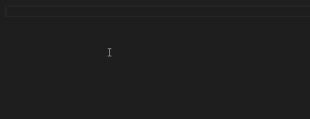
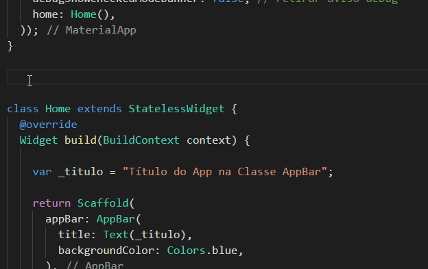

# Desenvolvimento Android e IOS com Flutter


## Material desenvolvido durante o curso na [Udemy](https://www.udemy.com/desenvolvimento-android-e-ios-com-flutter/)

### Sumário 

1. [Criando meu primeiro App](https://github.com/andermelo/udemy-desenvolvimento-android-ios-flutter/tree/master/primeiro_app)

<!-- 1. Aprenda Dart do zero -->
1. Dart Intermediário e avançado
    1. [Funções](https://gist.github.com/andermelo/4e4b32f8b240d7bb5d829f141113392c#file-funcoes-dart)
    1. [Funções anônimas & parâmetros](https://gist.github.com/andermelo/4e4b32f8b240d7bb5d829f141113392c#file-funcoes-dart)
    1. [Classes e objetos](https://gist.github.com/andermelo/)
    1. [Construtores](https://gist.github.com/andermelo/)
    1. [Getter e Setter](https://gist.github.com/andermelo/)
    1. [Herança](https://gist.github.com/andermelo/)
    1. [Sobrescrita de métodos](https://gist.github.com/andermelo/)
    1. [Modificadores Static e Final](https://gist.github.com/andermelo/)
    1. [Classes abstratas](https://gist.github.com/andermelo/)
    1. [Interface](https://gist.github.com/andermelo/)
    1. [Mixins](https://gist.github.com/andermelo/)
    1. [Coleções - listas](https://gist.github.com/andermelo/)
    1. [Coleções - mapas](https://gist.github.com/andermelo/)
<!-- 1. Resumo da Linguagem Dart -->

1. Componentes de interface
    1. Colunas e linhas
    1. [Formatação de textos](#formatação-de-textos)
    1. [Botões](#botões)
    1. [Espaçamento](#espaçamento)
    1. [Alinhamento](#alinhamento)
    1. [Imagens](#imagens)
    1. [Layout base com Scaffold](#layout-base-com-scaffold)
    1. [Widgets - Stateless & Stateful](#widgets---stateless--stateful)
    1. [App 1 Frases do Dia](frases_do_dia/)
    1. [App 2 JokenPo](/jokenpo)

1. Componentes de entrada de dados
    1. [Utilizando caixas de texto](entrada_dados/lib/CampoTexto.dart)
    1. [App 3 Etanol ou Gasolina](alcool_ou_gasolina/)
    1. [Utilizando Checkbox](entrada_dados/lib/EntradaCheckbox.dart)
    1. [Utilizando RadioButton](entrada_dados/lib/EntradaRadioButton.dart)
    1. [Utilizando Switch](entrada_dados/lib/EntradaSwitch.dart)
    1. [Utilizando Slider](entrada_dados/lib/EntradaSlider.dart)

1. Navegação
    1. [Navegando entre telas](navegacao/)
    1. [App 4 ATM Consultoria](atm_consultoria/)
    1. [Passando dados entre telas](dados_entre_telas/)
    1. [App 5 Cara ou Coroa](cara_coroa/)
    1. [Nomeando rotas](/navegacao/lib/main.dart#L7)

1. Consumo de serviço web
    1. [Criando requisições](consumo_servicos/lib/Home.dart#L28)    
    1. [Exibindo retorno da requisição na interface](consumo_servicos/lib/Home.dart)
    1. [#App6 Preço do bitcoin](preco_bitcoin/)
    1. [Utilizando listas (ListView)](utilizando_listas/)
        - [Eventos de clique & exibir dialog (AlertDialog)](utilizando_listas/lib/Home.dart#L41)
    1. [Trabalhando com Future](consumo_servico_avancado/lib/Home.dart)
        - [Carregando dados em uma lista (ListView)](consumo_servico_avancado/lib/Lista.dart)
        - [Requisição Post & Widget Expanded](consumo_servico_avancado/lib/RequisicaoPost.dart)
        - [Requisições Put, Patch e Delete](consumo_servico_avancado/lib/Requisicoes.dart)
    1. [#App7 Youtube](youtube/) 
        - [Botões de ação](youtube/lib/Home.dart#L27)
        - [Navegação inferior (BottomNavigationBar)](youtube/lib/Home.dart#L59)
        - [Ativando API](youtube/lib/Api.dart)
        - [Recuperando vídeos](youtube/lib/Api.dart#L35)
        - [Convertendo resultados](youtube/lib/model/Video.dart)
        - [Exibindo vídeos em uma lista (ListView)](youtube/lib/telas/Inicio.dart)
        - [Utilizando componente de pesquisa (SearchDelegate)](youtube/lib/CustomSearchDelegate.dart)
        - [Recuperando textos para pesquisa & Sugestões](youtube/lib/CustomSearchDelegate.dart#L33)
        - [Executando vídeos](youtube/lib/telas/Inicio.dart#L46)
    1. [Ciclo de vida Statefull Widget](youtube/lib/telas/Inicio.dart#L22-L44)

1. Manipulação de dados
    1. [Utilizando preferências](manipulacao_dados_preferenciais/)
    1. [Floating Action button](floating_action_button/)
    1. [#App8 Lista de tarefas](lista_tarefas/)
        - [Criando interface](lista_tarefas/lib/Home.dart)
        - [Salvando dados utilizando arquivo](lista_tarefas/lib/Home.dart#L17)
        - [Recuperando dados](lista_tarefas/lib/Home.dart#L63-L84)
        - [Criando e alterando status de uma tarefa](lista_tarefas/lib/Home.dart#L103-L118)
        - [Utilizando Dismissible widget](utilizando_dismissible_widget/)
        - [Removendo item com Dismissible](lista_tarefas/lib/Home.dart#L89-L149)
        - [Desfazendo ação com Snackbar](lista_tarefas/lib/Home.dart#L106-L122)
    <!-- 1. [Introdução ao banco de dados](#) -->
    1. [Configurando banco de dados](banco_de_dados/lib/main.dart#L18-L36)
    1. [Salvando dados](banco_de_dados/lib/main.dart#L38-L49)
    1. [Listando e filtrando](banco_de_dados/lib/main.dart#L51-L96)
    1. [Atualizando e deletando](banco_de_dados/lib/main.dart#L98-L130)
    1. [#App9 Notas diárias](minhas_anotacoes/)
        - [Criando interface](minhas_anotacoes/lib/Home.dart#L159-L224)
        - [Inicializando banco de dados](minhas_anotacoes/lib/Helper/AnotacaoHelper.dart)
        - [Salvando anotação](minhas_anotacoes/lib/Home.dart#L80-L106)
        - [Listando anotações](minhas_anotacoes/lib/Home.dart#L108-L127)
        - [Formatando datas](minhas_anotacoes/lib/Home.dart#L129-L139)
        - [Atualizando anotação](minhas_anotacoes/lib/Home.dart#L80-L106)
        - [Removendo anotação](minhas_anotacoes/lib/Home.dart#L141-L147)

1. Mídias
    1. [Executando sons](executando_sons/)
    1. [Pausando e parando](executando_sons/lib/main.dart#L26-L70)
    1. [Controlando volume](executando_sons/lib/main.dart#L80-L93)
    1. [Utilizando abas & TabBar](tabbar/)
    1. [#App10 Aprenda Inglês ](aprenda_ingles)
        - [Configurando temas & abas](aprenda_ingles/lib/telas/Home.dart)
        - [Criando interface com GridView & MediaQuery](aprenda_ingles/lib/telas/Bichos.dart#L31-L72)
        - [Executando sons](aprenda_ingles/lib/telas/Bichos.dart#L11-L23)
    1. [Executando vídeos](executando_videos/)

1. Firebase 
    1. [Configurando projeto no Android](firebase/)
    1. [Configurando projeto no iOS](firebase/)
    1. [Estrutura de dados](https://firebase.google.com/docs/firestore/data-model)
    1. [Salvando & atualizando](firebase/lib/main.dart#L8-L34)
    1. [Removendo & recuperando](firebase/lib/main.dart#L36-L71)
    1. [Aplicando filtros básicos](firebase/lib/main.dart#L76-L83)
    1. [Pesquisa de texto](firebase/lib/main.dart#L76-L94)
    1. [Cadastro e verificação de usuário logado](firebase/lib/main.dart#L100-L133)
    1. [Logar e deslogar usuário](firebase/lib/main.dart#L117-L126)
    1. [Selecionando imagens - câmera & galeria de fotos](firebase/lib/main.dart#L150-L167)
    1. [Upload de imagens com Storage](firebase/lib/main.dart#L169-L200)
    1. [Status do Upload & Baixando imagens](firebase/lib/main.dart#L202-L211)

1. WhatsApp [App 11](whatsapp/)
    1. [Configurando o projeto](whatsapp/)
    1. [Criando interface de login](whatsapp/lib/Login.dart)
    1. [Criando interface de cadastro](whatsapp/lib/Cadastro.dart)
    1. [Validando cadastro de usuário](#)
    1. [Cadastro de usuário](#)
    1. [Login de usuário](#)
    1. [Salvando dados do usuário](#)
    1. [Criando interface com abas](#)
    1. [Listando conversas](#)
    1. [Menu de opções - PopupMenuButton](#)
    1. [Recursos de rotas - avançado](#)
    1. [Criando tela de configurações](#)
    1. [Fazendo upload da imagem do perfil](#)
    1. [Atualizando dados do perfil](#)
    1. [Listando contatos](#)
    1. [Abrindo tela de mensagem](#)
    1. [Criando interface de mensagem - parte 1](#)
    1. [Criando interface de mensagem - parte 2](#)
    1. [Salvando mensagem & ajuste na interface](#)
    1. [Recuperando mensagens](#)
    1. [Trocando mensagens](#)
    1. [Enviando imagem na mensagem](#)
    1. [Salvando conversa](#)
    1. [Listando conversas](#)
    1. [Ajustes & Definindo tema Android e IOS](#)
    1. [Rolando mensagens automaticamente](#)

1. Mapas e Geolocalização
    1. [Configurando API](#)
    1. [Configurando o projeto](#)
    1. [Utilizando a câmera no Mapa](#)
    1. [Movimentando a câmera no Mapa](#)
    1. [Adicionando marcadores](#)
    1. [Desenhando Polygons](#)
    1. [Desenhando Polylines](#)
    1. [Recuperando local do usuário](#)
    1. [Exibindo local do usuário](#)
    1. [Utilizando Geocoding](#)

1. [Recursos utilizados](#recursos-utilizados)
1. [Referência bibliográfica](#referência-bibliográfica)

## Formatação de textos
```dart
import 'package:flutter/material.dart';

void main(){
  runApp(MaterialApp(
    title: "Frases do dia",
    home: Container(
      color: Colors.white,
      child: Column(
          children: <Widget>[
          Text(
              "Mussum Ipsum",
              style: TextStyle(
                fontSize: 50,
                fontStyle: FontStyle.italic,
                fontWeight: FontWeight.normal,
                letterSpacing: 0,
                wordSpacing: 0,
                decoration: TextDecoration.underline,
                decorationColor: Colors.black,
                decorationStyle: TextDecorationStyle.solid,
                color: Colors.blue),
            ),
          ],
        ),
    ),
  ));
}
```

## Botões
```dart
import 'package:flutter/material.dart';

void main(){
  runApp(MaterialApp(
    title: "Frases do dia",
    home: Container(
      color: Colors.white,
      child: Column(
          children: <Widget>[
            FlatButton(
                onPressed: (){
                  print("botao pressionado");
                }, 
                child: Text("Botão",
                  style: TextStyle(
                      fontSize: 40,
                      color: Colors.black,
                      decoration: TextDecoration.none                      
                    ),
                )
              )
          ],
        ),
    ),
  ));
}
```
## Espaçamento
```dart
import 'package:flutter/material.dart';

void main(){
  runApp(MaterialApp(
    debugShowCheckedModeBanner: false,
    title: "Frases do dia",
    home: Container(
      padding: EdgeInsets.fromLTRB(0, 0, 0, 0),
      // margin: EdgeInsets.all(30),
      margin: EdgeInsets.only(top: 50),
      decoration: BoxDecoration(
        border: Border.all(width: 3, color: Colors.white)
      ),
      // color: Colors.white,
      child: Column(
          children: <Widget>[
            Text("t1"),

            Padding(
              padding: EdgeInsets.all(30),
              child: Text("t2"),
            ),

            Text("t3"),
            // Text(
            //   "Manduma pindureta quium dia nois paga. Todo mundo vê os porris que eu tomo, mas ninguém vê os tombis que eu levo!",
            //   textAlign: TextAlign.justify,
            // )
          ],
        ),
    ),
  ));
}
```

## Alinhamento
```dart
import 'package:flutter/material.dart';

void main(){
  runApp(MaterialApp(
    debugShowCheckedModeBanner: false,
    title: "Frases do dia",
    home: Container(
      margin: EdgeInsets.only(top: 40),
      decoration: BoxDecoration(
        border: Border.all(width: 3, color: Colors.white)
      ),
      // color: Colors.white,
      child: Column(
          children: <Widget>[
            Text("Salsicha"),
            Text("Batata"),
            Text("Frango"),
          ],
          mainAxisAlignment: MainAxisAlignment.spaceEvenly,
          crossAxisAlignment: CrossAxisAlignment.center,
        ),
    ),
  ));
}
```

## Imagens
> É necessário alterar o arquivo `pubspec.yaml` para incluir as imagens no projeto primeiro

```
...
  assets:
    - images/mesa.jpg
    - images/parque.jpg
...
```

```dart
import 'package:flutter/material.dart';

void main(){
  runApp(MaterialApp(
    debugShowCheckedModeBanner: false, // retirar aviso debug
    title: "Frases do dia",
    home: Container(
      margin: EdgeInsets.only(top: 40),
      decoration: BoxDecoration(
        border: Border.all(width: 3, color: Colors.white)
      ),
      // color: Colors.white,
      child: Image.asset(
        "images/mesa.jpg",
        fit: BoxFit.scaleDown,
      ),
    ),
  ));
}
```
> Mais em [flutter.dev/.../images-class.html](https://api.flutter.dev/flutter/widgets/Image-class.html)

##  Layout base com Scaffold
> Scaffold class layout base para o seu app

```dart
import 'package:flutter/material.dart';

void main(){
  runApp(MaterialApp(
    debugShowCheckedModeBanner: false, // retirar aviso debug
    home: Scaffold(
      appBar: AppBar(
        title: Text("Título do App na Classe AppBar"),
        backgroundColor: Colors.blue,
      ),
      body: Padding(
        padding: EdgeInsets.all(15),
        child: Text("Conteúdo principal"),
      ),
      bottomNavigationBar: BottomAppBar(
        color: Colors.lightBlue,
        child: Padding(
            padding: EdgeInsets.all(15),
            child: Row(
              children: <Widget>[
                Text("Conteúdo na Classe BottomAppBar"),
              ],
            ),
          ),
      ),
    ),
  ));
}
```

## Widgets - Stateless & Stateful

> Stateless -> Widgets que não podem ser alterados (constantes)



> Stateful -> Widgets que podem ser alterados (variáveis)



## Recursos utilizados
* DartPad - editor online para linguagem Dart [dartpad.dartlang.org](https://dartpad.dartlang.org/)
* [Flutter](https://flutter.dev/docs)
* Visual Studio Code
* [Material Design](https://material.io/)

## Referência Bibliográfica

* Dart [dart.dev](https://dart.dev/guides)
* Flutter [flutter.dev](https://flutter.dev/docs)
* Material Design [material.io](https://material.io/)
