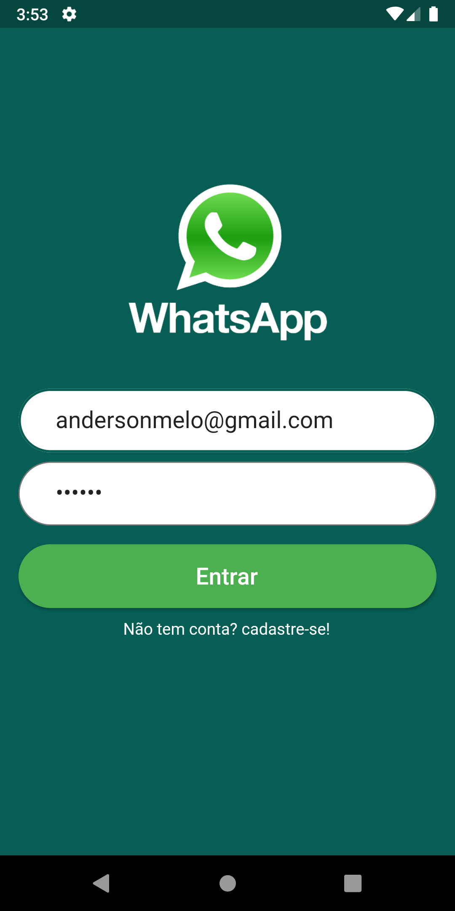
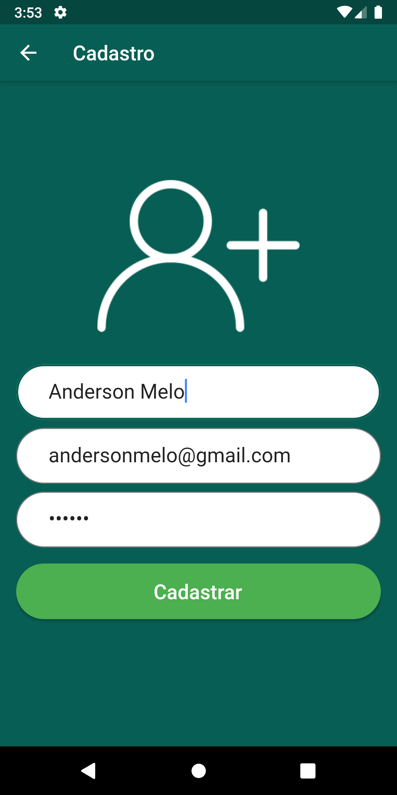

# WhatsApp

WhatsApp clone

## Recursos utilizados

  * [firebase_core](https://pub.dev/packages/firebase_core)
  * [firebase_auth](https://pub.dev/packages/firebase_auth)
  * [cloud_firestore](https://pub.dev/packages/cloud_firestore)
  * [firebase_storage](https://pub.dev/packages/firebase_storage)
  * Correção de erros
    * [Como migrar para o AndroidX](https://developer.android.com/jetpack/androidx/migrate)
    * [Configure aplicativos com mais de 64 K métodos](https://developer.android.com/studio/build/multidex)
    * [problemas com AndroidX](https://stackoverflow.com/questions/54823084/flutter-error-android-dependency-androidx-corecore-has-different-version-us)
  * [image_picker](https://pub.dev/packages/image_picker)
  * [Widget SafeArea](https://api.flutter.dev/flutter/widgets/SafeArea-class.html)
  * [StremBuilder](https://api.flutter.dev/flutter/widgets/StreamBuilder-class.html)
  
  
  
  

    
